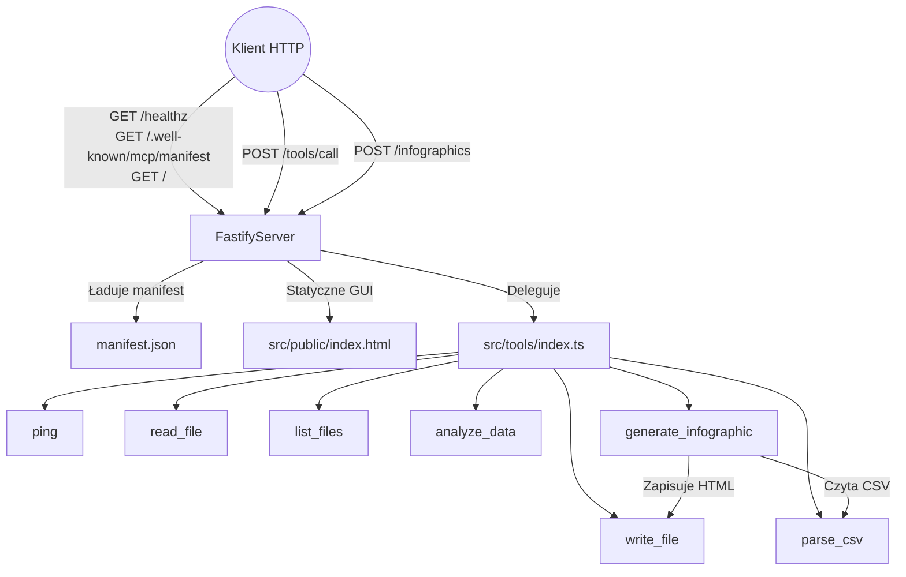

# mr-mcp
Minimalny serwer Model Context Protocol (MCP) udostępniający narzędzia HTTP do operacji na plikach i danych CSV oraz generowania infografik HTML.
> Source: manifest.json:2-7

## Spis treści
- [Architektura](#architektura)
- [Możliwości i funkcje (Capabilities)](#możliwości-i-funkcje-capabilities)
- [Publiczne API / Punkty wejścia](#publiczne-api--punkty-wejścia)
- [Konfiguracja i środowisko](#konfiguracja-i-środowisko)
- [Instalacja i szybki start](#instalacja-i-szybki-start)
- [Przepływy pracy (Sposoby pracy)](#przepływy-pracy-sposoby-pracy)
- [Testy i jakość](#testy-i-jakość)
- [Integracje i zewnętrzne usługi](#integracje-i-zewnętrzne-usługi)
- [Ograniczenia i znane problemy](#ograniczenia-i-znane-problemy)
- [Roadmap / TODO](#roadmap--todo)
- [Załączniki](#załączniki)
- [Słownik pojęć](#słownik-pojęć)
- [Luki informacyjne](#luki-informacyjne)

## Architektura

> Source: src/server.ts:57-151, src/tools/index.ts:29-117, src/tools/generate_infographic.ts:41-140, src/tools/parse_csv.ts:32-62, src/tools/write_file.ts:32-43

## Możliwości i funkcje (Capabilities)
- **Monitorowanie kondycji serwera** – `GET /healthz` zwraca `{"status":"ok"}` do sond zdrowotnych; wywołanie: `curl http://localhost:8765/healthz`; brak skutków ubocznych.
  > Source: src/server.ts:62-63
- **Udostępnianie manifestu MCP** – `GET /.well-known/mcp/manifest` zwraca manifest uzupełniony o dynamicznie rejestrowane narzędzia; wywołanie: `curl http://localhost:8765/.well-known/mcp/manifest`; efekt: JSON opisujący endpointy i schematy.
  > Source: src/server.ts:64-67, src/tools/index.ts:29-117
- **Interfejs webowy** – `GET /` serwuje kartę HTML z dokumentacją workflow i przykładami; można otworzyć w przeglądarce (`http://localhost:8765/`).
  > Source: src/server.ts:69-73, src/public/index.html:1-198
- **Jednolity punkt wywołań narzędzi** – `POST /tools/call` obsługuje formaty `tool_use`, `tool_result` i legacy payloady MCP; przyjmuje `tool` i `input`, waliduje przez Zod i deleguje do wybranej implementacji. Błąd walidacji skutkuje `400 Invalid input`.
  > Source: src/server.ts:19-127
- **Generowanie infografik przez HTTP** – `POST /infographics` waliduje dane `csvPath`, `outputPath`, `title`, uruchamia narzędzie `generate_infographic`, zwraca `201` i rezultat MCP.
  > Source: src/server.ts:75-84
- **Narzędzie `ping`** – wejście: `{ "message": string }`; wynik: echo i znacznik czasu ISO. Wywołanie: `curl -X POST http://localhost:8765/tools/call -H 'Content-Type: application/json' -d '{"tool":"ping","input":{"message":"hello"}}'`.
  > Source: src/tools/ping.ts:3-35, tests/server.test.ts:58-77
- **Narzędzie `read_file`** – wejście: `{ "path": string }`; czyta plik w katalogu projektu; efekt: `{ content }` lub błąd opisowy.
  > Source: src/tools/read_file.ts:5-42
- **Narzędzie `write_file`** – wejście: `{ "path": string, "content": string }`; tworzy katalogi, zapisuje UTF-8 i potwierdza sukces.
  > Source: src/tools/write_file.ts:5-43
- **Narzędzie `list_files`** – wejście opcjonalne `directory`; zwraca listę nazw z dozwolonego katalogu projektu.
  > Source: src/tools/list_files.ts:5-42
- **Narzędzie `parse_csv`** – wejście `path`; zwraca nagłówki i wiersze (trimowane, ignoruje puste). Przy pustym pliku wynik to puste tablice.
  > Source: src/tools/parse_csv.ts:5-62
- **Narzędzie `analyze_data`** – wejście `path` i opcjonalna `column`; buduje statystyki (liczba wierszy, nazwy kolumn, próbka 3 rekordów, top wartości kolumny).
  > Source: src/tools/analyze_data.ts:5-62
- **Narzędzie `generate_infographic`** – wejście `csvPath`, opcjonalne `outputPath`, `title`; tworzy stylizowany HTML (do 100 pierwszych wierszy) i zapisuje na dysku.
  > Source: src/tools/generate_infographic.ts:6-140

## Publiczne API / Punkty wejścia
### HTTP
| Metoda | Ścieżka | Opis | Kluczowe parametry | Wynik |
| --- | --- | --- | --- | --- |
| GET | `/healthz` | Health-check Fastify | – | `{ "status": "ok" }` |
| GET | `/.well-known/mcp/manifest` | Manifest MCP z listą narzędzi | – | JSON z `name`, `tools` |
| GET | `/` | Statyczna karta HTML | – | Dokument GUI |
| POST | `/tools/call` | Router narzędzi MCP (obsługa `tool_use`, `tool_result`, legacy) | Body zawiera `tool`, `input` lub wynik | Odpowiedź `tool_result` / `tool_result_ack` lub `400/404` |
| POST | `/infographics` | Skrót do generowania infografiki | `csvPath`, opcjonalnie `outputPath`, `title` | `201`, `tool_result` z sukcesem |
> Source: src/server.ts:62-127

### Narzędzia MCP (wywoływane przez `/tools/call`)
| Nazwa | Wejście (schemat) | Rezultat |
| --- | --- | --- |
| `ping` | `{ message: string }` | Echo i ISO timestamp |
| `read_file` | `{ path: string }` | `{ content: string }` |
| `write_file` | `{ path: string, content: string }` | `{ success: true, path }` |
| `list_files` | `{ directory?: string="." }` | `{ files: string[] }` |
| `parse_csv` | `{ path: string }` | `{ headers: string[], rows: Record<string,string>[] }` |
| `analyze_data` | `{ path: string, column?: string }` | Statystyki `totalRows`, `columns`, `sample`, opcjonalnie `columnStats` |
| `generate_infographic` | `{ csvPath: string, outputPath?: string, title?: string }` | `{ success: true, outputPath, rowsProcessed }` |
> Source: src/tools/index.ts:29-106, src/tools/ping.ts:3-35, src/tools/read_file.ts:5-42, src/tools/write_file.ts:5-43, src/tools/list_files.ts:5-42, src/tools/parse_csv.ts:5-62, src/tools/analyze_data.ts:5-62, src/tools/generate_infographic.ts:6-140

### CLI (pnpm scripts)
| Komenda | Cel |
| --- | --- |
| `pnpm dev` | Uruchamia serwer Fastify w trybie watch przez `tsx` |
| `pnpm build` | Kompiluje TypeScript do katalogu `dist/` |
| `pnpm start` | Startuje zbudowany serwer Node.js |
| `pnpm lint` | Uruchamia ESLint dla plików `.ts` |
| `pnpm typecheck` | Weryfikuje typy poprzez `tsc --noEmit` |
| `pnpm test` / `pnpm test:watch` | Uruchamia testy Vitest (jednorazowo lub w watch) |
> Source: package.json:2-30

## Konfiguracja i środowisko
- **Wersje narzędzi** – kontener bazuje na `node:20-alpine`, ustawia `NODE_ENV=production` oraz wymaga pnpm przez Corepack.
  > Source: Dockerfile:1-21
- **Środowisko uruchomienia** – domyślny port pobierany z `PORT` (fallback `8765`); serwer nasłuchuje na `0.0.0.0`.
  > Source: src/server.ts:139-151
- **Pliki i katalogi robocze** – wejściowe CSV przechowywane w `data/`, wyjściowe HTML w `output/`, a `.gitignore` pomija generowane artefakty.
  > Source: .gitignore:1-9, data/responses.csv:1-6
- **Konfiguracje narzędzi developerskich** – TypeScript korzysta z `rootDir: src`, `outDir: dist`, ścisły tryb; ESLint używa presetów JS/TS i reguły `no-console` (info/warn/error dozwolone); Vitest pracuje w środowisku Node i raportuje pokrycie.
  > Source: tsconfig.json:1-17, eslint.config.js:1-18, vitest.config.ts:1-12
- **Manifest MCP** – statyczny plik JSON opisuje nazwę serwera, endpoint HTTP i schematy narzędzi.
  > Source: manifest.json:1-125

## Instalacja i szybki start
Wariant Python
```
Nieustalone w repo.
```

Wariant Node
```bash
corepack enable # aktywuje pnpm wymagane przez build
pnpm install # instaluje zależności produkcyjne i developerskie
pnpm dev # uruchamia serwer Fastify na porcie 8765 w trybie watch
```
> Source: Dockerfile:6-11, package.json:7-13

Po uruchomieniu można przetestować narzędzie:
```bash
curl -X POST http://localhost:8765/tools/call \
  -H "Content-Type: application/json" \
  -d '{"tool":"list_files","input":{"directory":"data"}}'
```
> Source: tests/server.test.ts:133-148

## Przepływy pracy (Sposoby pracy)
- **Praca developerska** – `pnpm dev` uruchamia serwer z logami Fastify; zmiany w kodzie ładowane na gorąco.
  > Source: package.json:7, src/server.ts:57-73
- **Budowanie i publikacja** – `pnpm build` kompiluje TypeScript do `dist/`, a `pnpm start` uruchamia artefakty; kontener Docker odtwarza te kroki w warstwie build/runtime.
  > Source: package.json:8-9, Dockerfile:5-22
- **Testy ciągłe** – `pnpm test` uruchamia zestaw Vitest sprawdzający endpointy, walidacje i skutki uboczne (np. tworzenie plików HTML/TXT).
  > Source: package.json:12, tests/server.test.ts:24-235, tests/tools.test.ts:20-61
- **Workflow „CSV → infografika”** – 1) umieść dane `data/responses.csv`; 2) użyj `analyze_data` do weryfikacji; 3) wywołaj `generate_infographic` (HTTP lub `/infographics`); 4) otwórz wynik w `output/`.
  > Source: src/public/index.html:167-197, src/tools/analyze_data.ts:35-58, src/tools/generate_infographic.ts:41-135, tests/server.test.ts:215-234
- **Uruchomienie kontenerowe** – `docker-compose up --build` wystawia usługę `mcp-server` na porcie 8765 z sondą zdrowotną.
  > Source: docker-compose.yml:1-13

## Testy i jakość
- **Testy jednostkowe/integracyjne** – Vitest z konfiguracją `environment: "node"`, raportami pokrycia i zakresem `tests/**/*.test.ts`.
  > Source: vitest.config.ts:1-12
- **Scenariusze testowe** – testy potwierdzają zdrowie, manifest, walidację payloadów, działanie każdego narzędzia i endpointu `/infographics`.
  > Source: tests/server.test.ts:24-235, tests/tools.test.ts:20-61
- **Linting i formatowanie** – ESLint łączy rekomendacje JS/TS z konfiguracją Prettier oraz ostrzega przed nieautoryzowanym `console`.
  > Source: eslint.config.js:1-18
- **Kontrola typów** – `pnpm typecheck` uruchamia `tsc --noEmit`, korzystając z ustawień ścisłej kontroli w `tsconfig.json`.
  > Source: package.json:11, tsconfig.json:2-16

## Integracje i zewnętrzne usługi
Repozytorium operuje lokalnie na systemie plików i nie wywołuje zewnętrznych API; wszystkie narzędzia korzystają z modułów `fs`, `path` i walidacji Zod.
> Source: src/tools/read_file.ts:1-42, src/tools/write_file.ts:1-43, src/tools/list_files.ts:1-42, src/tools/parse_csv.ts:1-62, src/tools/generate_infographic.ts:1-140

## Ograniczenia i znane problemy
- Operacje na plikach ograniczone do katalogu projektu – próba użycia ścieżek poza `process.cwd()` kończy się błędem „Dostęp zabroniony”.
  > Source: src/tools/read_file.ts:22-42, src/tools/write_file.ts:21-42, src/tools/list_files.ts:22-42, src/tools/parse_csv.ts:21-61
- Generator infografik renderuje maksymalnie 100 pierwszych wierszy CSV oraz nie wykonuje agregacji danych poza listą kolumn.
  > Source: src/tools/generate_infographic.ts:49-135
- Parser CSV zakłada separator przecinka i nie obsługuje cytowanych wartości ani różnych separatorów.
  > Source: src/tools/parse_csv.ts:44-55

## Roadmap / TODO
Nieustalone w repo.

## Załączniki
### Kluczowe pliki i ich rola
| Ścieżka | Rola |
| --- | --- |
| `src/server.ts` | Serwer Fastify rejestrujący endpointy MCP i delegujący do narzędzi |
| `src/tools/index.ts` | Rejestr definicji narzędzi i manifestów |
| `src/tools/*.ts` | Implementacje narzędzi operujących na danych i plikach |
| `src/public/index.html` | Statyczna karta użytkownika z instrukcjami workflow |
| `tests/server.test.ts` | Testy integracyjne pokrywające endpointy HTTP i narzędzia |
| `tests/tools.test.ts` | Testy narzędzi plikowych na przykładowym CSV |
| `manifest.json` | Deklaracja serwera MCP i schematów wejścia |
| `Dockerfile` | Definicja obrazu wieloetapowego (build + runtime) |
| `docker-compose.yml` | Orkiestracja usługi kontenerowej z healthcheck |
> Source: src/server.ts:57-151, src/tools/index.ts:29-117, src/tools/ping.ts:3-35, src/tools/read_file.ts:5-42, src/tools/write_file.ts:5-43, src/tools/list_files.ts:5-42, src/tools/parse_csv.ts:5-62, src/tools/analyze_data.ts:5-62, src/tools/generate_infographic.ts:6-140, src/public/index.html:1-198, tests/server.test.ts:1-235, tests/tools.test.ts:1-61, manifest.json:1-125, Dockerfile:1-22, docker-compose.yml:1-13

## Słownik pojęć
- **MCP (Model Context Protocol)** – protokół manifestu i narzędzi używany przez serwer (`name`, `version`, `tools`).
  > Source: manifest.json:1-125
- **Tool Result ACK** – odpowiedź potwierdzająca odebranie `tool_result` bez dalszego przetwarzania.
  > Source: src/server.ts:89-113
- **Infografika** – HTML wygenerowany przez narzędzie `generate_infographic`, zapisany do `output/`.
  > Source: src/tools/generate_infographic.ts:41-135

## Luki informacyjne
- Brak w repozytorium planu rozwoju (roadmapy) ani komentarzy TODO.
- Brak udokumentowanych zależności Python/poza ekosystemem Node – potencjalne działania wymagają dodatkowych ustaleń.
